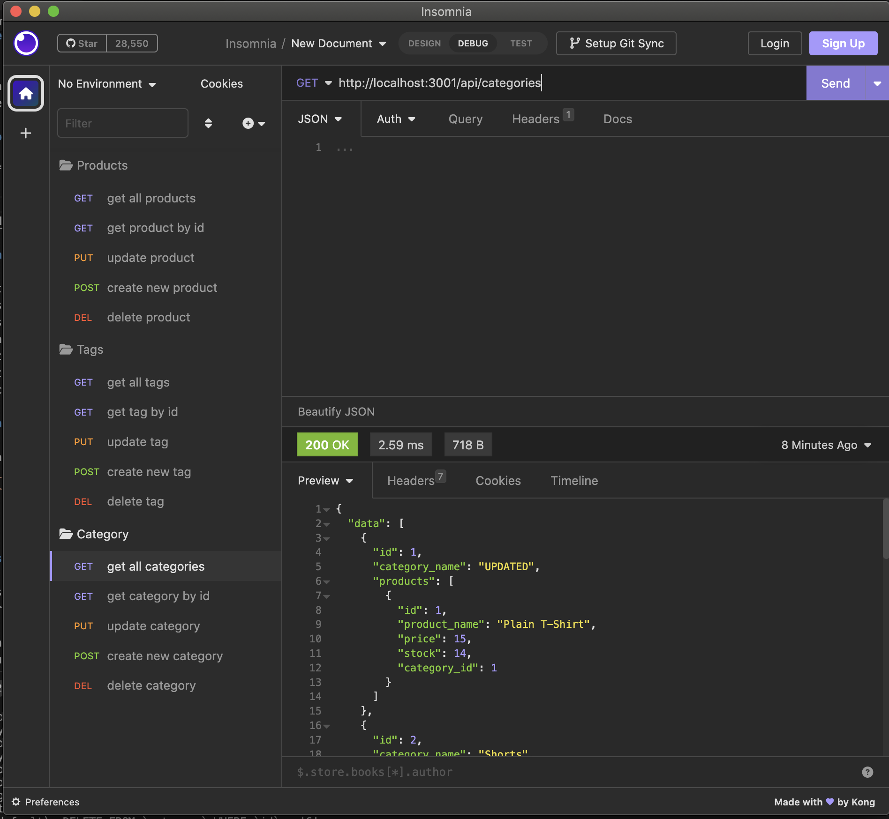

# Ecommerce Backend CRUD 

## Description 

This application provides convenient access to a MySQL database that stores relational data from an e-commerce site. It enables you to effortlessly parse JSON into PUT and POST routes, allowing you to add or update the database. Additionally, you can effortlessly target specific endpoints to view the database or delete records as needed.

## Mock-Up

The following video shows an example of the application being used from Insomnia: {click picture}

[](https://drive.google.com/file/d/1L6Yvk-bUjeMkQ0wZz2rUbWnGayDKR6nh/view)


## Installation:

```bash
npm install dotenv@^8.2.0, express@^4.18.2, mysql2@^2.3.3 sequelize@^6.32.0
npm run seed
npm run watch
```


## Usage
```
1.Install Dependencies:
Ensure that all required dependencies are installed by running the necessary commands.

2.Copy the .env.EXAMPLE file -> rename it to .env -> fill in your details

3.Run npm seed:
Execute the command npm run seed to initiate, populate and sync your MySQL db.

4.Run npm watch:
Execute the command npm run watch to initiate the server.

4.Navigate to insomnia and target the api endpoints:

```

###

Written by Christian Alteri

To learn more about other projects, [click here](https://github.com/ChristianAlteri).

####

[](LICENSE)
